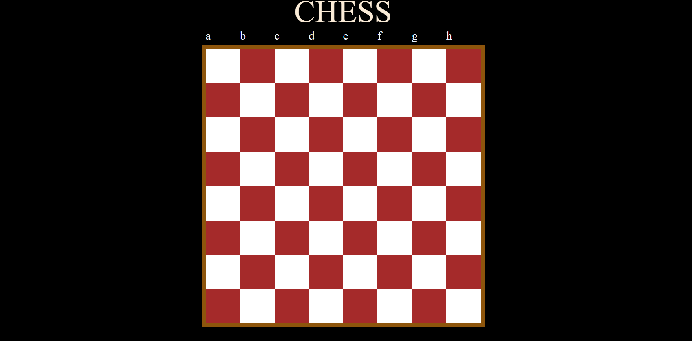

# ♟️ [Chess Board UI](https://gursewak-codes.github.io/Chess_css/)

---

## 🖼️ Preview  

---

## 🚀 About  
A simple **Chess Board UI** built using HTML & CSS, focusing on layout and grid structure.

---

## 🛠️ Tech Stack  
- HTML5  
- CSS3  

---

## 📚 What I Learned  
- Creating grid layouts  
- Using CSS for pattern design  
- Aligning elements properly  

---

## 📬 Connect  
- GitHub: https://github.com/gursewak-codes  
- LinkedIn: https://www.linkedin.com/in/gursewak-singh-a0280a351  

---

⭐️ Star the repo if you like it!
